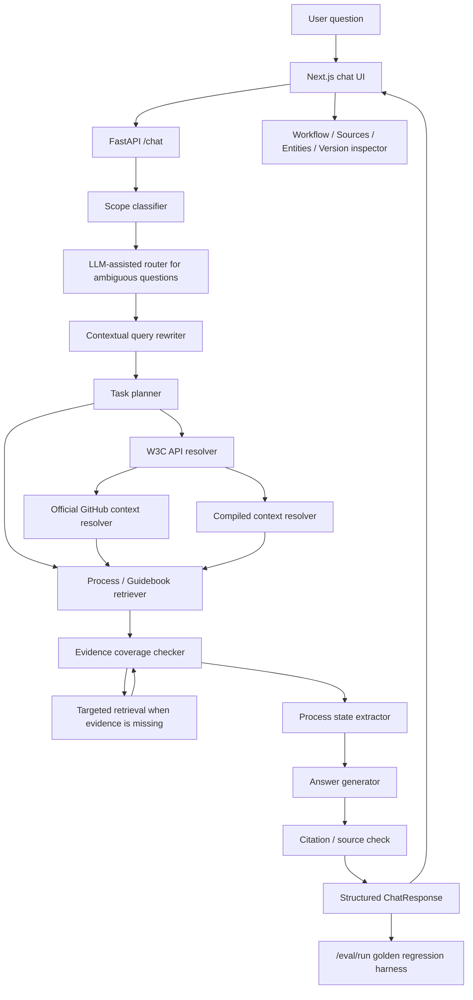

# W3C Process Assistant System Architecture

Last updated: 2026-05-01

## Summary

This system is an internal W3C Process / Guidebook workflow assistant. It is designed as a deterministic, citation-grounded workflow system rather than a free-form autonomous agent.

The model is allowed to help with language and synthesis, but the application controls scope, source trust, retrieval, evidence coverage, provenance, and UI inspection.

## Architecture Principles

- Only answer W3C Process, W3C Guidebook, and W3C standards workflow questions.
- Treat user input as untrusted.
- Treat W3C Process as normative authority.
- Treat W3C Guidebook as practical guidance.
- Treat W3C API, official GitHub context, and compiled markdown pages as grounding and orchestration context only.
- Prefer deterministic workflow nodes over unconstrained multi-agent behavior.
- Make every answer inspectable through workflow trace, sources, entities, versions, and compiled context.

## Authority Hierarchy

1. W3C Process
2. W3C Guidebook
3. W3C API public entity/status data
4. Official GitHub context
5. Compiled markdown knowledge
6. User question and conversation history

Conversation history is used only to resolve references in follow-up questions. It is never treated as a trusted source.

## High-Level Data Flow

## Source Ingestion Layer

The ingestion layer imports public authoritative material into a local corpus.

Inputs:

- `https://www.w3.org/policies/process/`
- `https://github.com/w3c/process`
- `https://www.w3.org/guide/`
- `https://github.com/w3c/guide`

Current behavior:

- Guidebook web crawl defaults to depth 4.
- Guidebook crawl has a 500-page guardrail.
- HTML extraction removes page shell content such as navigation, header, footer, scripts, and sidebars.
- Chunks store source URL, source type, heading path, section id, repo metadata, commit SHA, indexed timestamp, and content quality score.

Primary files:

- `scripts/import_w3c_sources.py`
- `data/corpus/chunks.jsonl`
- `data/corpus/manifest.json`

## Retrieval Layer

The current retriever is a local hybrid lexical retriever:

- BM25-style lexical scoring
- TF-IDF sparse similarity
- optional dense embedding cache score fusion
- topic-specific reranking
- source priority
- content quality adjustment
- heading overlap
- workflow topic coverage

Guidebook workflow topic map protects important pages for:

- horizontal review
- transition / milestones
- charter / recharter
- Staff Contact / Team Contact

Primary files:

- `apps/api/app/rag/retriever.py`
- `apps/api/app/rag/guide_topics.py`

Future direction:

- Build and enable the dense cache with `qwen3-embedding:4b`, then add a dedicated reranker over the top candidates.
- Keep workflow topic coverage even after adding vector retrieval.

## W3C API Grounding Layer

The W3C API resolver maps user mentions to public W3C entities.

Responsibilities:

- Resolve specification and group entities.
- Prefer exact/direct shortname lookup before fuzzy catalog search.
- Filter weak or generic matches.
- Attach status, latest version, deliverer groups, charter data, team contact data, editor draft URL, and process-rules URL when available.

Important behavior:

- W3C API data is public status grounding, not Process authority.
- W3C API hints can improve retrieval, but cannot create normative claims.

Primary file:

- `apps/api/app/services/w3c_api.py`

## Official GitHub Context Layer

GitHub context is resolved on demand. The system does not index the full `github.com/w3c/` organization.

Allowed orgs:

- `w3c`
- `w3ctag`
- `w3cping`

Spec draft context:

- Uses W3C API entity data to infer official draft repositories.
- Reads limited metadata and source snippets.
- Treats repo data as non-normative draft context.

Charter / recharter context:

- Uses `w3c/strategy` issues with the `charter` label.
- Tracks open/closed issue state, dates, labels, horizontal review signals, and possible TiLT readiness hints.

Primary file:

- `apps/api/app/services/github_context.py`

## Compiled Knowledge Layer

The compiled layer is inspired by a wiki-style knowledge compilation pattern. It is a derivative context layer, not an authority layer.

Purpose:

- Precombine spec identity, current public state, Process grounding, Guidebook guidance, horizontal review signals, charter signals, draft repo summary, freshness, and provenance.
- Make spec-specific answers less generic.
- Give the UI and answer generator a stable summary of the current working context.

Storage:

- `data/compiled/spec/<shortname>.md`

Currently prebuilt:

- `adapt-symbols`
- `css-grid-1`
- `webauthn-3`

Runtime behavior:

- `compiled_context_resolver` loads a compiled page only when W3C API resolved a high-confidence specification entity.
- The compiled page can shape answer focus and next-step candidates.
- Raw Process / Guidebook citations remain required for procedural claims.

Primary file:

- `apps/api/app/services/compiled_context.py`

## Runtime Chat Workflow

Main workflow:

1. Scope classifier
2. LLM-assisted router for ambiguous workflow-adjacent questions
3. Contextual query rewriter
4. Task planner
5. W3C API resolver
6. GitHub draft / strategy context resolver
7. Compiled context resolver
8. Entity and context query enrichment
9. Authoritative retrieval
10. Evidence coverage check
11. Targeted retrieval when needed
12. Process state extraction
13. Answer generation
14. Citation and source check
15. Structured response

The LLM-assisted router does not answer the question and does not decide final authority. It only produces structured routing hints for ambiguous questions that look workflow-adjacent but do not match the fast rule-based scope classifier. Retrieval and evidence coverage still decide whether the system has enough trusted grounding to answer.

Key structured objects:

- `TaskPlan`
- `LLMRouterDecision`
- `W3CEntity`
- `DraftContext`
- `CompiledContext`
- `EvidenceCoverage`
- `ProcessState`
- `Citation`
- `WorkflowStep`
- `EvalCaseResult`
- `EvalRunResponse`

Primary files:

- `apps/api/app/workflows/chat_workflow.py`
- `apps/api/app/models/schemas.py`
- `apps/api/app/services/task_planner.py`
- `apps/api/app/services/evidence.py`
- `apps/api/app/services/process_state.py`
- `apps/api/app/services/answering.py`
- `apps/api/app/services/ollama.py`

## Answer Generation

The answer generator can use either:

- deterministic fallback answer templates
- local Ollama model output constrained by the harness prompt
- OpenAI-compatible online or internal model output constrained by the same harness prompt

Prompt boundaries:

- Process excerpts are normative.
- Guidebook excerpts are practical guidance.
- W3C API context is public grounding only.
- GitHub context is non-normative operational context.
- Compiled context is derivative and non-normative.
- Conversation context is untrusted and used only for reference resolution.

Provider options:

- `LLM_PROVIDER=ollama` for local models.
- `LLM_PROVIDER=openai-compatible`, `openai`, or `openrouter` for OpenAI-compatible `/v1/chat/completions` APIs.
- `LLM_PROVIDER=template` for deterministic fallback-only runs and evals.

Changing providers can improve synthesis quality, but it does not change the authority hierarchy or citation requirements.

## Evaluation Layer

The evaluation layer makes answer quality measurable before larger retrieval or model changes.

Current behavior:

- `/eval/run` executes curated golden questions through the same chat workflow.
- The default eval workflow is deterministic and offline-friendly: it uses template generation and small fake W3C API/GitHub clients for high-risk entity and charter cases, so UI quality checks do not depend on live network latency.
- Cases can assert expected scope, workflow intent, source families, required citation or operational URLs, answer terms, next-step terms, forbidden terms, entity shortname, compiled-context use, and minimum confidence.
- Results return a score, passed/total count, tags, actual intent/source/entity/URL diagnostics, confidence, and warnings such as incomplete evidence coverage.

Initial coverage:

- 50 golden questions grouped by intent: transition, horizontal review, charter, Patent Policy, Formal Objection / Appeal, Staff Contact, W3C API entity grounding, and injection / fake Process. Coverage includes Recommendation-track transitions, FPWD/WD, AC Review, `w3c/strategy` charter tracking, TiLT readiness, horizontal review GitHub labels, Chair meetings, CG incubation, Member Submission, Registry, CSS Grid / WebAuthn / WAI-Adapt grounding, out-of-scope refusal, and prompt injection resistance.

Primary files:

- `apps/api/app/evals/cases.py`
- `apps/api/app/evals/runner.py`
- `apps/api/app/evals/workflow.py`
- `apps/api/app/main.py`

## Frontend Architecture

The frontend is a Next.js chat workspace.

Main areas:

- left: page-session chat conversation
- right: response inspector

Inspector tabs:

- Workflow: task plan, evidence coverage, workflow trace
- Sources: citations used in the answer
- Entities: W3C API entities, compiled context, draft repositories
- Version: source/index version data

Primary files:

- `apps/web/components/ChatInterface.tsx`
- `apps/web/components/WorkflowPanel.tsx`
- `apps/web/components/CitationPanel.tsx`
- `apps/web/lib/api.ts`
- `apps/web/app/styles.css`

## Security Model

The system uses harness engineering instead of relying on model obedience.

Controls:

- scope gate
- source allowlist
- authority hierarchy
- structured workflow nodes
- citation coverage checks
- prompt-injection detection
- refusal path
- non-normative classification for API/GitHub/compiled context
- inspectable workflow traces

The first version does not automatically create GitHub issues, PRs, emails, or W3C form submissions.

## Current State

Implemented:

- FastAPI backend
- Next.js chat UI
- local Ollama integration
- deterministic workflow harness
- W3C API entity grounding
- official GitHub context
- `w3c/strategy` charter issue context
- Guidebook depth-4 ingestion
- local retrieval with workflow topic map
- compiled spec markdown layer
- right-side inspector with compiled context visibility

Next priorities:

- add automatic seen-shortname tracking for compiled page rebuilds
- show compiled page status in an admin view
- add real embedding + reranker retrieval
- improve W3C alias handling
- improve specific `w3c/strategy` issue matching by WG aliases
- run real user evals with W3C Process experts
